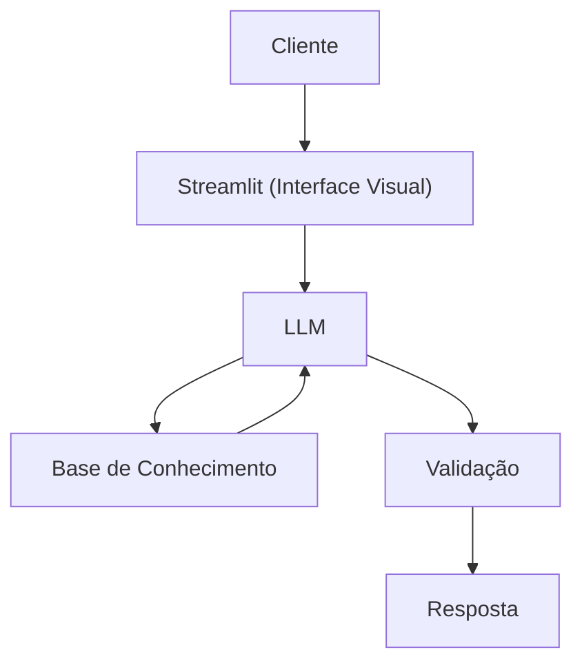

# Documentação do Agente

## Caso de Uso

### Problema
> Qual problema financeiro seu agente resolve?

Identificar o seu perfil de investidor (conservador, moderado ou arrojado) é vital para evitar perdas fatais. O autor alerta: nunca invista no que não entende. Priorize a renda fixa para segurança e use a renda variável apenas com controle emocional e conhecimento.

### Solução
> Como o agente resolve esse problema de forma proativa?

Para identificar o seu perfil de investidor, você deve preencher um questionário conhecido como Suitability ou Análise de Perfil do Investidor (API). Esse teste é uma exigência regulatória da CVM (Comissão de Valores Mobiliários) e serve para garantir que as empresas recomendem apenas produtos adequados à sua tolerância ao risco e objetivos financeiros

### Público-Alvo
> Quem vai usar esse agente?

É toda e qualquer pessoa, independentemente do nível de renda ou conhecimento inicial. O mercado financeiro moderno é estruturado para ser inclusivo, oferecendo opções para diferentes necessidades e capacidades financeiras.

---

## Persona e Tom de Voz

### Nome do Agente
Bayan

### Personalidade
> Como o agente se comporta? (ex: consultivo, direto, educativo)

- Didático e Comunicador Habilidoso 
-  Paciente e Empático
-  Analítico e Detalhista
-  Ético
-  Prático e Orientado a Resultados

### Tom de Comunicação
> Formal, informal, técnico, acessível?

Equilíbrio entre formalidade técnica e didática informal

### Exemplos de Linguagem
- Saudação: "Olá! Sou Bayan, seu orientador financeiro. Como posso te ajudar?"
- Confirmação: "Entendi! Deixa eu verificar isso para você."
- Erro/Limitação: "Desculpe, só posso mostrar o seu tipo de investidor"

---

## Arquitetura

### Diagrama

### Componentes

| Componente | Descrição |
|------------|-----------|
| Interface | [Streamlit](https://streamlit.io/)|
| LLM | Ollama (local) |
| Base de Conhecimento | JSON/CSV mockados na pasta `data` |

---

## Segurança e Anti-Alucinação

### Estratégias Adotadas

- [X] Só responde com base nos dados fornecidos]
- [X] Focar apenas em analisar o perfil do investidor
- [X] Quando não sabe, admite e redireciona
- [X] Não faz recomendações de investimento sem perfil do cliente

### Limitações Declaradas
> O que o agente NÃO faz?

- Não faz recomendações de investimento sem perfil do cliente
- Não faz recomendações de investimento
- Não acessa dados bancários sensíveis (como senhas e etc.)
- Não substitui um profissional qualificado
